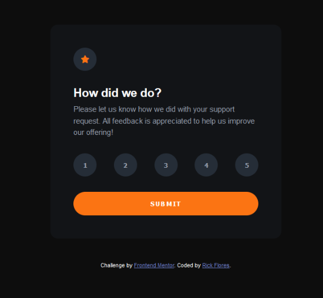
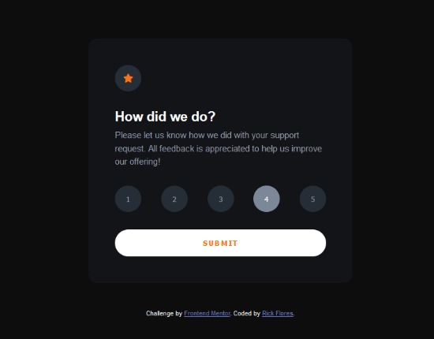
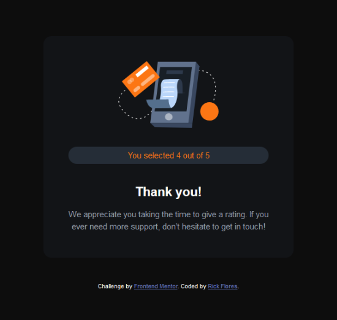

# Frontend Mentor - Interactive rating component solution

This is a solution to the [Interactive rating component challenge on Frontend Mentor](https://www.frontendmentor.io/challenges/interactive-rating-component-koxpeBUmI). Frontend Mentor challenges help you improve your coding skills by building realistic projects.

## Overview

### The challenge

Users should be able to:

- View the optimal layout for the app depending on their device's screen size
- See hover states for all interactive elements on the page
- Select and submit a number rating
- See the "Thank you" card state after submitting a rating

### Screenshots
Initial State



Hover State



Thank-You State



### Links

- Solution URL: [View my solution](https://www.frontendmentor.io/solutions/interactive-rating-component-using-scss-variablesnesting-and-flexbox-HkK4qPK8c)
- Live Site URL: [View live example](https://rick-flores.github.io/Frontend-Mentor_Interactive-Rating-Component/)

## My process

### Built with

- Semantic HTML5 markup
- Sass/SCSS
- Flexbox
- Vanilla Javascript

### What I learned

#### Sass makes styling easier

Using Sass to style this rating component made it very easy by utilizing Sass variables and nesting.

Here is an example of scss variables:
```scss
// VARIABLES

//colors
$orange: hsl(25, 97%, 53%);
$white: hsl(0, 0%, 100%);
$lt-grey: hsl(217, 12%, 63%);
$md-grey: hsl(216, 12%, 54%);
$drk-blue: hsl(213, 19%, 18%);
$v-drk-blue: hsl(216, 12%, 8%);

//typography
$font-sz: 15px;
$font-fam: Overpass sans-serif;
```
Here is an example of scss nesting:
```scss
.rating {
	h1 {
		margin-bottom: 0.5rem;
	}
	ul {
		display: flex;
		list-style: none;
		justify-content: space-between;
		margin-bottom: 2rem;
		// dynamic class added with javascript
		.selected {
			background-color: $md-grey;
			color: $white;
		}
	}
	p {
		line-height: 1.5;
		margin-bottom: 2rem;
		color: $lt-grey;
	}
}
```

#### Javascript is challenging | My solution

One of the most challenging parts of this project was figuring out how to make my ".selected" class only appear on one rating selection at a time. I feel my solution was a little hacky and there is perhaps a better and cleaner way to have done it. Please let me know your thoughts!

```js
const thankYouState = document.getElementById('thank-you')
const ratingState = document.getElementById('rating')
const submitBtn = document.getElementById('submit')
const ratingOptions = document.getElementById('rating-options')
const ratingSelection = document.getElementById('rating-selection')

document.addEventListener('DOMContentLoaded', () => {
	let selection

	ratingOptions.addEventListener('click', (e) => {
		const ratingBtn = e.target
		selection = e.target.id
		ratingOptions.childNodes.forEach((child, index) => {
			if (index % 2) {
				if (child.firstChild !== ratingBtn) {
					child.firstChild.classList.remove('selected')
				}
			}
			ratingBtn.classList.add('selected')
		})
		return selection
	})

	submitBtn.addEventListener('click', (e) => {
		ratingState.style.display = 'none'
		thankYouState.style.display = 'block'
		ratingSelection.innerText = `${selection}`
	})
})
```

### Continued development

Some of the things I would like to continue working on is trying to add some animations and transitions to make for a better user experience.

### Useful resources

- [MDN Docs](https://developer.mozilla.org/) - The perfect go-to resource when you get stuck.

## Author

- Frontend Mentor - [@RICK-FLORES](https://www.frontendmentor.io/profile/RICK-FLORES)
- Twitter - [@RICK_FLORES_DEV](https://www.twitter.com/RICK_FLORES_DEV)
- LinkedIn - [Rick Flores](https://www.linkedin.com/in/rick-flores-dev/)
